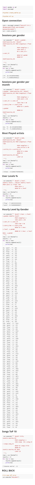

The README file includes a summary of the project, how to run the Python scripts, and an explanation of the files in the repository. Comments are used effectively and each function has a docstring.

# Project: Data Modeling with Postgres

## The main purpose of the Database

This database will be used to OLAP so it´s best to optimize it to aggregations and analytical query´s.
The anlytical team can get fast insigths of the business (.

## Database schema design and the ETl pipeline**

The schema used is a star schema, where in the center is the the songplays table, the fact table, and around the star is the dimensions table (songs, artistsm, time and users). This schema is denormalized what have benefits of:
  
  - simply querys
  - query performance gains
  - fast aggregations
  
  
  
The ETL pipeline process data from two datasets:

**The Song Data set**

Json files, partitioned by the first three letters os the song track id in a file system.

<pre>
song_data/A/B/C/TRABCEI128F424C983.json
song_data/A/A/B/TRAABJL12903CDCF1A.json
</pre>

And below is an example of what a single song file, TRAABJL12903CDCF1A.json, looks like.

<pre>
{ "num_songs": 1,
  "artist_id": "ARJIE2Y1187B994AB7",
  "artist_latitude": null, "artist_longitude": null,
  "artist_location": "",
  "artist_name": "Line Renaud", 
  "song_id": "SOUPIRU12A6D4FA1E1", 
  "title": "Der Kleine Dompfaff", 
  "duration": 152.92036, 
  "year": 0}
</pre>

**The Log Datase**

Consit of log files in JSON format. What simulate the sparkfy app. The log is partioned by year and month.


<pre>
log_data/2018/11/2018-11-12-events.json
log_data/2018/11/2018-11-13-events.json
</pre>

img src="images/log-data.png" alt="log-image" width="500" height="600"       


**The pipeline** open a connection to the data base and first process the song_data, beacuse the next process, log data, need to query the databse to find the song_id and the artist_id. The second is dependent on the first one. This is a simple pipeline, in the real world there is no control over the data already inserted in the database in the song_data. It should control the file list already treated.
The second query load log files and filter the data by page equal to 'NextSong', then convert data to appropriate format (datetime), than populate the databases time, user and songplays records. To populate the songplay record there is a query to match the music_id and artist_id based on other information (song name, artist name and duration). The process of iterate over rows is costly and would make many nulls if the song_data is not already updated.

## How to Run the Scripts

The build was made in a `Python 3.6.3` version.
The requirements are in  file where are the versions of pandas and psycopg2 packages (the main packages used).

> Run in the terminal:
```
>python create_tables.py
>python etl.py
```
Im Python Notebokks

>!python create_tables.py
>
>!python etl.py

## Query Examples

From the notebook [Analytical_querys.ipynb](\Analytical_querys.ipynb)


